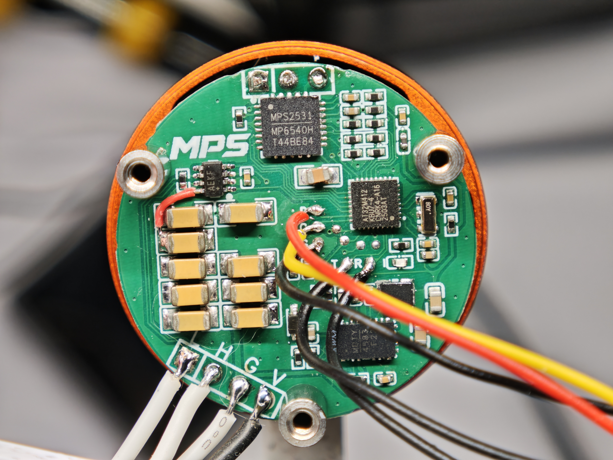

# MPS MotorDriver

基于 **AT32M412 + MP6540H + MA600A** 的一体化有感 FOC 电机驱动模组，支持电流、速度、位置三环控制，并可作为 CAN 总线上的独立关节节点运行。

## 项目简介

MPS MotorDriver 将三相功率级、磁编码器、主控和通信接口集成在电机模组内部。固件围绕真实硬件逐级完成了 PWM 与采样、电流重构、编码器标定、三环闭环、故障保护以及双节点 CAN 轨迹控制。

项目的最终演示目标是使用两套电机节点驱动五连杆机构，在 X-Track 上完成轨迹规划并绘制 MPS Logo。当前双节点通信和整套 Logo 轨迹已经跑通，机构跟随精度与最终展示效果仍在持续优化。

## 核心特性

- 有感 FOC：Clarke/Park、反 Park 与七段式 SVPWM。
- 三级控制环：16 kHz 电流环、1 kHz 速度环、1 kHz 位置环。
- 三相低边电流采样：有效窗口判定、无效相剔除、KCL 补相和极性归一化。
- MA600A 磁编码器：4 kHz 独立采集、方向归一化、自动标定、Flash 持久化和异常样本诊断。
- CAN 关节节点：`DISCOVER / ARM / SYNC / STOP / CLEAR_FAULT` 状态机、100 Hz 轨迹点、反馈与健康状态上报。
- 关节坐标配置：节点号、机械零点、方向、软限位、双槽记录、CRC 与掉电恢复。
- 故障保护：驱动器故障、过流、电流不平衡、母线欠压/过压、编码器异常、CAN 超时与总线故障。
- 在线调参：通过 `debug.lksscope` 修改三环和保护参数，并观察控制环内部变量。
- 双构建链：支持 ARM GCC/CMake 和 Keil MDK/ARMCC5。
- 可追溯开发记录：保留设计、计划、主机测试、实机日志和问题复盘。

## 硬件组成

| 模块 | 器件/接口 | 作用 |
| --- | --- | --- |
| 主控 | AT32M412KBU7-4 | Cortex-M4，180 MHz，128 KB Flash，16 KB RAM |
| 三相功率级 | MP6540H | 三路高边 PWM 输入、内部栅极驱动与三相电流镜 |
| 位置传感器 | MA600A | 同轴绝对式磁编码器，SPI2 读取 |
| 板载电源 | MP4583 | 为模组提供降压电源 |
| 总线接口 | CAN 2.0B / MAX3051 | 500 kbit/s 节点通信 |
| 调试接口 | J-Link + USART1 | 下载、单步调试和 RT-Thread Shell |

主要外设分配：

- TMR1：三相中心对齐 PWM，16 kHz。
- ADC2：三相电流镜与 VBUS 采样。
- TMR7 + SPI2：MA600A 4 kHz 定时采集。
- CAN1：轨迹命令、同步控制、反馈和健康状态。
- USART1：115200 baud 调试 Shell。

## 控制与软件架构

```text
application/
├── motor_app.c                 应用初始化与周期服务
├── motor_shell.c               串口调试命令
└── motor_control/
    ├── foc_core.c              Clarke/Park/IPark/SVPWM
    ├── current_loop.c          D/Q 轴电流 PI
    ├── speed_loop.c            速度 PI 与斜坡
    ├── position_loop.c         位置 P、速度前馈与保持
    ├── motor_control_isr.c     16 kHz 实时控制入口
    ├── motor_tuning.c          RAM 在线参数与环路快照
    ├── encoder_service.c       编码器采集、过滤与标定
    ├── can_motion_service.c    CAN 节点状态机与轨迹调度
    ├── joint_config_service.c  关节配置加载与持久化
    └── fault_manager.c         故障锁存与清除

platform/at32m412/              AT32M412 外设和 Flash 适配
communication/                  CAN 帧与协议编解码
middlewares/                    RT-Thread Nano 与 MA600A 驱动
tests/                          主机单元测试、静态契约和台架脚本
```

实时控制链：

```text
MA600A / ADC
      │
      ▼
位置环 1 kHz ──► 速度目标
      │
      ▼
速度环 1 kHz ──► Iq 目标
      │
      ▼
电流环 16 kHz ─► Vd/Vq ─► SVPWM ─► MP6540H ─► 电机
```

## 快速开始

### ARM GCC / CMake

需要在环境中提供 `cmake`、Ninja/Make 和 `arm-none-eabi-gcc`。项目当前在 WSL 下完成 ARM GCC 构建验证。

```bash
cmake -S . -B build/Debug -DCMAKE_BUILD_TYPE=Debug
cmake --build build/Debug --clean-first -j2
```

主要输出：

```text
build/Debug/MPS_MotorDriver.elf
```

### Keil MDK

使用 Keil uVision 打开：

```text
project/MDK_V5/MPS_MotorDriver.uvprojx
```

工程使用 ARMCC5 构建，输出 AXF/HEX，并包含当前控制、CAN、关节配置和在线整定模块。

> 电机上电前请确认限流电源、编码器方向、三相接线和 CAN 终端电阻。首次运行应保持电机空载，并先执行停机与故障状态检查。

## 调试方式

### RT-Thread Shell

常用命令：

| 命令 | 作用 |
| --- | --- |
| `mc_state` / `fault` / `pwm_info` | 查看控制状态、故障和 PWM 安全状态 |
| `mc_cal` | 标定三相电流零偏 |
| `enc_cal_start auto` / `enc_cal_status` | 启动并检查编码器自动标定 |
| `mc_cur` / `mc_speed` / `mc_pos` | 分别启动电流、速度和位置控制 |
| `mc_debug` / `mc_current` | 查看 FOC 与电流采样诊断 |
| `joint_cfg_set` / `joint_cfg_show` | 写入或查看节点关节坐标配置 |
| `can_status` / `can_diag_reset` | 查看或清理 CAN 诊断计数 |
| `mc_stop` | 停止全部模式并关闭 MP6540H |

### LKS Scope

打开仓库根目录的 [`debug.lksscope`](debug.lksscope)，加载当前 ARM GCC ELF 后，可以：

- 修改电流环、速度环、位置环和保护参数；
- 查看目标值、反馈值、积分项、限幅前后输出及饱和状态；
- 查看编码器、ADC、电流重构、PWM、故障和 CAN 运行状态。

ELF 发生布局变化后，可重新索引变量地址：

```bash
python3 scripts/index_lksscope_addresses.py \
  --scope debug.lksscope \
  --elf build/Debug/MPS_MotorDriver.elf
```

### 自动化测试

`tests/` 中包含：

- C 语言主机单元测试；
- Python 静态契约与协议测试；
- 电流环、速度环、位置环实机台架脚本；
- CANalyst-II 节点仿真和 Stage 8 CAN 验收工具。

## 当前状态

| 项目 | 状态 |
| --- | --- |
| PWM、ADC、电流重构与电流环 | 已完成主机测试和实机验证 |
| MA600A 采集、自动标定与掉电恢复 | 已完成两套模组实机验证 |
| 速度环与位置环 | 已实现并完成单电机受限响应验证 |
| CAN 节点协议、关节配置与同步轨迹 | 已实现并通过软件及双节点硬件联调 |
| LKS Scope 三环在线整定 | 已实现 |
| 双电机 MPS Logo 整套轨迹 | 已跑通 |
| 五连杆负载下的跟随精度与最终展示 | 持续优化中 |

最近一次合并后验证包含 32 个 Python 测试脚本、6 个相关主机 C 测试目标、ARM GCC clean build，以及 Keil ARMCC5 `0 Error / 0 Warning` 构建。

## 文档导航

- [FOC 软件总体设计](docs/superpowers/specs/2026-06-22-mps-foc-design.md)
- [双节点 CAN 与同步轨迹设计](docs/superpowers/specs/2026-07-21-dual-node-can-trajectory-design.md)
- [单电机位置与速度前馈设计](docs/superpowers/specs/2026-07-21-single-motor-position-feedforward-design.md)
- [LKS Scope 三环在线整定设计](docs/superpowers/specs/2026-07-27-three-loop-lksscope-tuning-design.md)
- [位置环响应测试报告](docs/motor-control/test-reports/2026-07-22-xtrack-position-response.md)
- [FOC 控制器开发记录](doc/FOC控制器开发记录.md)
- [完整调试记录](doc/调试记录.md)
